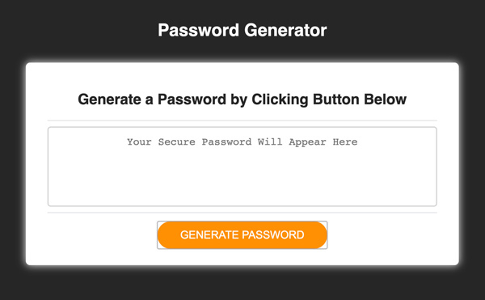
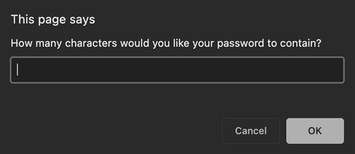
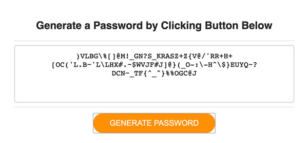

# Password Generator

## Information

This one-page site enables users to generate a password of at least eight (8) characters and no more than 128 characters using four (4) character types (special characters, numerical characters, lowercase and uppercase characters).

## How to Generate a Password

In order to generate a password, the user must first 'click' on the orange button, prompting a new window enabling the user to input the length of the desired password.

Upon clicking the orange button, the user will be able to type and click on the key features the user would like to include for the generated password.

* A new window prompt will appear displaying the specified length (8-128 characters).

* A question confirming the inclusion or denial of Special Characters, Numerical Characters, Lowercase Characters and Uppercase Characters is presented. By clicking 'OK', the user is permitting the password generator to include that specific type of character. By clicking 'Cancel', the user is denying the use of that character and it WILL NOT be included as part of the generated password. At least ONE (1) characted must be enabled in order to genereate a password. Clicking 'Cancel' on all FOUR (4) questions, voids the creation of the password.

* A password is displayed based upon the users designated inputs on the prompt.

